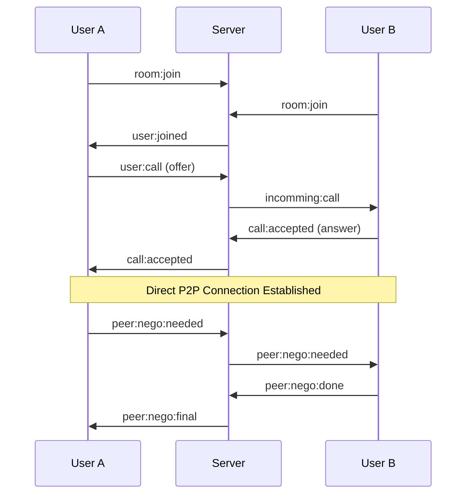

# 🎥 WebRTC Video Calling Application

A real-time peer-to-peer video calling application built with React, Socket.IO, and WebRTC technology. Experience seamless video communication with direct peer connections for optimal performance.

   

## ✨ Features

- 🎯 **One-on-One Video Calls** - Crystal clear peer-to-peer video communication
- 🔊 **High-Quality Audio** - Real-time audio streaming with echo cancellation
- 🏠 **Room-Based System** - Join specific rooms with custom room IDs
- 🚀 **Real-Time Connection** - Instant user detection and connection establishment
- 📱 **Responsive Design** - Works seamlessly across devices
- 🔄 **Automatic Reconnection** - Smart ICE negotiation for optimal connections
- 🎮 **Simple Interface** - User-friendly lobby and calling interface

## 🛠️ Tech Stack

### Frontend
- **React.js** - Modern UI framework
- **React Router** - Client-side routing
- **Socket.IO Client** - Real-time communication
- **WebRTC API** - Peer-to-peer media streaming
- **Navigator.mediaDevices** - Camera/microphone access

### Backend
- **Node.js** - Runtime environment
- **Socket.IO** - WebSocket-based signaling server
- **Express.js** - Web framework (implied)

## 🏗️ Architecture

```
┌─────────────────┐    ┌─────────────────┐    ┌─────────────────┐
│   Client A      │    │  Signaling      │    │   Client B      │
│   (React)       │    │   Server        │    │   (React)       │
│                 │    │  (Socket.IO)    │    │                 │
├─────────────────┤    ├─────────────────┤    ├─────────────────┤
│ • Video Stream  │◄──►│ • Room Mgmt     │◄──►│ • Video Stream  │
│ • Audio Stream  │    │ • User Discovery│    │ • Audio Stream  │
│ • WebRTC Peer   │    │ • Message Relay │    │ • WebRTC Peer   │
│ • Socket Client │    │ • ICE Exchange  │    │ • Socket Client │
└─────────────────┘    └─────────────────┘    └─────────────────┘
         │                                              │
         └──────────── Direct P2P Connection ──────────┘
                        (Video/Audio Data)
```

## 📖 How to Use

### Starting a Video Call

1. **Enter the Lobby**
   - Open the application in your browser
   - Enter your email address
   - Create or join a room with a Room ID

2. **Wait for Connection**
   - Share the Room ID with the person you want to call
   - Wait for them to join the same room

3. **Initiate the Call**
   - Click the "Call" button when you see "Connected" status
   - Grant camera and microphone permissions when prompted

4. **Enjoy Your Call**
   - Your video appears in "My Stream"
   - Remote user's video appears in "Remote Stream"

### Room Management
- Each room supports exactly 2 users
- Room IDs can be any string (e.g., "meeting-room-1", "family-call")
- Users are automatically notified when someone joins/leaves

## 📁 Project Structure

```
webrtc-video-calling-app/
├── client/
│   ├── src/
│   │   ├── components/
│   │   ├── context/
│   │   │   └── SocketProvider.js    # Socket.IO context
│   │   ├── pages/
│   │   │   ├── Lobby.js             # Room joining interface
│   │   │   └── Room.js              # Video calling interface
│   │   ├── service/
│   │   │   └── peer.js              # WebRTC peer connection
│   │   └── App.js                   # Main routing component
│   ├── public/
│   └── package.json
├── server/
│   ├── index.js                     # Signaling server
│   └── package.json
└── README.md
```

## 🔧 Configuration

### Server Configuration
The server accepts the following configurations:

```javascript
const io = new Server(8000, {
  cors: {
    origin: "http://localhost:3000", // Your client URL
  },
});
```

### WebRTC Configuration
Default STUN servers are used for NAT traversal. For production, consider adding TURN servers:

```javascript
const configuration = {
  iceServers: [
    { urls: 'stun:stun.l.google.com:19302' },
    // Add TURN servers for production
  ]
};
```

## 🎯 API Events

### Client → Server Events
- `room:join` - Join a specific room
- `user:call` - Initiate a call with offer
- `call:accepted` - Accept incoming call with answer
- `peer:nego:needed` - Request renegotiation
- `peer:nego:done` - Complete renegotiation

### Server → Client Events
- `room:join` - Confirm room join
- `user:joined` - Notify about new user
- `incomming:call` - Receive call invitation
- `call:accepted` - Call acceptance confirmation
- `peer:nego:needed` - Renegotiation request
- `peer:nego:final` - Renegotiation completion

## 🔍 WebRTC Flow


